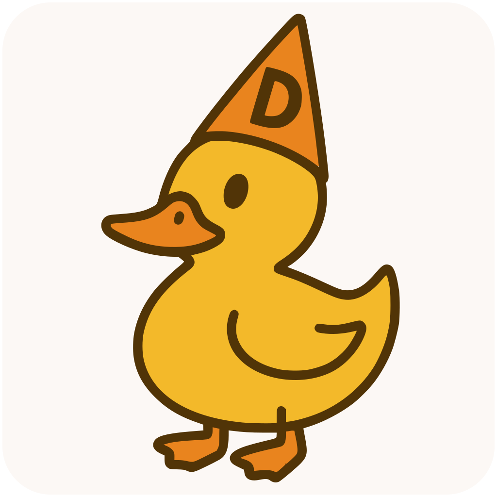

# Dumbky 🦆



**Dumbky** 🚀 is a cross-platform, free, and open-source GUI REST client. It's designed to be simple and user-friendly, making API testing and development accessible to everyone! 🌟

**Note:** Dumbky is currently a work in progress 🛠️. Expect changes, and feel free to contribute or report issues! 🐛

## Features ✨

- Intuitive GUI for sending REST requests. 📡
- Cross-platform support: Windows 🪟, macOS 🍏, and Linux 🐧.
- Free and open-source. 🆓
- Lightweight and fast, built with Golang. 🏃

## Installation 🛠️

### macOS 🍎

You can install Dumbky using Homebrew:

```bash
brew tap ChristianWSmith/dumbky
brew install dumbky
```


### Windows 🪟 and Linux 🐧

For Windows and Linux, you can download the latest release artifacts from the [Releases](https://github.com/ChristianWSmith/dumbky/releases/latest) page. 📦

## Usage 🎛️

1. **Launch Dumbky**: Open the application from your installed applications or run it from the command line. 🖥️

2. **Create a Request**: Click on the + button to start a new REST request. 📝

3. **Configure the Request**: Enter the request URL, select the HTTP method, and add any headers or body content. ⚙️

4. **Send the Request**: Click the "Send" button to send the request and view the response. 📤

More detailed usage instructions and screenshots will be added as Dumbky develops. 📸

## Contributing 🤝

We welcome contributions! If you'd like to contribute to Dumbky, please follow these steps:

1. Fork the repository. 🍴
2. Create a new branch for your feature or bug fix. 🌿
3. Make your changes and commit them with descriptive messages. ✏️
4. Push your changes to your fork. 🔄
5. Submit a pull request to the main repository. 🏦

## Building from Source 🏗️

To build Dumbky from source, you'll need to have Golang installed on your system. Clone the repository and run the following commands:

```bash
$ git clone https://github.com/ChristianWSmith/dumbky.git
$ cd Dumbky
$ go build
```

## Roadmap 🗺️

- [ ] Add support for saving request histories. 💾
- [ ] Implement environment variables for request configuration. 🔧
- [ ] Add support for automated testing scripts. 🤖
- [ ] Enhance UI/UX for better user experience. 🎨

*This roadmap is tentative and subject to change.* 🔄

## License 📄

Dumbky is licensed under the MIT License. Feel free to use, modify, and distribute it as per the terms of the license. 🆓

## Contact 📞

If you have any questions or feedback, feel free to open an issue or contact the maintainers. 💬

---

Dumbky and its mascot, the duck in a dunce cap 🦆🎓, are here to make your API testing a little more fun and a lot simpler! 🎉
